## TRABAJO PRÁCTICO 

# B. GRAMÁTICAS Y LENGUAJES 

13. Defina los conjuntos $P$ de la gramática de $G =  (\lbrace S, A, B, C\rbrace, \lbrace0, 1\rbrace, S, P )$ que reconozca: 

    $0 0 1 0 1 0$​​ 

    Realizado por: **Mauricio Fariello**

    **Respuesta**:

    $P = \lbrace S \rightarrow A10, A \rightarrow B10, B \rightarrow C0, C \rightarrow 0\rbrace$

    *Explicación*:

    + Se debe crear el conjunto $P$ formado por las producciones que generen la secuencia de caracteres $001010$.
    + Estas producciones o reglas de derivación son aplicadas de la siguiente manera para reconocer la cadena:
      + Partimos del axioma "$S$" aplicando la regla de producción $S \rightarrow A10$ produciendo $A10$.
      + Aplicamos a ese resultado la regla $A \rightarrow B10$ y obtenemos $B1010$.
      + Luego aplicamos $B \rightarrow C0$ produciendo $C01010$.
      + Luego aplicamos $C \rightarrow 0$ reconociendo así la cadena solicitada $001010$​.

    ---

    Realizado por: **Gustavo Arauz**

    $P = \lbrace S\rightarrow 0A0,\space A\rightarrow 01B, \space B\rightarrow 0C ,\space C\rightarrow 1\rbrace$​​

    *Explicación*:

    + Se debe crear el conjunto $P$ formado por las producciones que generen la secuencia de caracteres $001010$.
    + Las reglas de derivación aplicadas son:
      + Partimos del axioma "$S$" aplicando la regla de producción $S\rightarrow 0A0$ produciendo $0A0$
      + Aplicando a ese resultado la regla $A\rightarrow 01B$ produciendo $001B0$
      + Luego aplicamos $B\rightarrow 0C$ produciendo $0010C0$
      + Luego aplicamos $C\rightarrow 1$ reconociendo así la cadena solicitada $001010$.

14. Defina los conjuntos $P$ de la gramática de $G = ( \lbrace S, A, B, C\rbrace, \lbrace0, 1\rbrace, S, P )$ que reconozca: 

    $0 0 0 1 0 1$​ 

    $P = \lbrace S \rightarrow A01, A \rightarrow B1, B \rightarrow C0, C \rightarrow C0 | 0 \rbrace$​

    $S \rightarrow \underline{A}01 \rightarrow \underline{B}101 \rightarrow \underline{C}0101 \rightarrow \underline{C}00101 \rightarrow 000101$

    *Explicación*:

    + Se debe crear el conjunto $P$ formado por las producciones que generen la secuencia de caracteres $000101$.
    + Las reglas de derivación aplicadas son:
      + Partimos del axioma "$S$" aplicando la regla de producción $S\rightarrow A01$ produciendo $A01$
      + Aplicando a ese resultado la regla $A\rightarrow B1$ produciendo $B101$
      + Luego aplicamos $B\rightarrow C0$ produciendo $C0101$
      + Luego aplicamos $C\rightarrow C0$ produciendo $C00101$.
      + Aplicamos $C\rightarrow 0$ reconociendo así la cadena solicitada $000101$

15. Definir las reglas de una gramática *Tipo 2* en base a la especificación dada, que reconozca el lenguaje: 

    $L1 = \lbrace w^n cw^n / w \in \lbrace a, b\rbrace n > 0\rbrace$

    $G1 = (\lbrace A, S\rbrace, \lbrace a, b, c\rbrace, P, S)$​​ 

    Realizado por: **Oscar León**

    a. Al definir una gramática, lo primero es analizar "la forma" de la cadena que se debe generar. En este caso, a izquierda y derecha de $c$ debe aparecer la misma subcadena, con la misma cantidad de símbolos $n>0$.

    b. La cantidad de $w$ está formada por los símbolos $a$ y $b$ según indica en la restricción $w \in \lbrace a,b\rbrace$.

    c. Se definen los símbolos terminales $\lbrace a,b,c\rbrace$ y no-terminales $\lbrace A,S \rbrace$, el conjunto $P$ debe incluir esos dos símbolos no-terminales.

    d. Finalmente sólo queda escribir el conjunto $P$ de reglas de producción.

    Definir las reglas de producción del conjunto $P$ es un proceso similar a diseñar un algoritmo, es decir, que hay que  definir reglas que generen lo que se busca obtener como resultado. 

    En este caso, vamos a definir el axioma de modo tal que garantice que a izquierda y derecha de $c$ genere la misma subcadena.

    $S \rightarrow a\space S \space a\space |\space b\space S\space b$

    Este axioma presenta recursión infinita.

    Por lo tanto es necesario plantear esta segunda versión de $S$, que no sea recursiva.

    $S \rightarrow a\space A \space a\space |\space b\space A\space b$

    $A \rightarrow c$
    
    Ejemplo de árbol generador

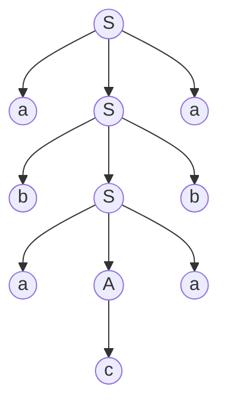

Cadena generada $a\space b\space a\space c\space a\space b\space a$

16. Defina las reglas de producción para el lenguaje: $L1 = \lbrace a^{n}\space c \space b^{m} / n > 0 \space \wedge \space m ≥ 0 \rbrace$ 

    Ejemplo de cadenas generadas por el lenguaje:

    | n    | m    |               |
    | ---- | ---- | ------------- |
    | 0    | 0    | $a^0cb^0=c$   |
    | 1    | 0    | $a^1cb^0=ac$  |
    | 0    | 1    | $a^0cb^1=cb$  |
    | 1    | 1    | $a^1cb^1=acb$ |

    Reglas de prdocción:

    $S\rightarrow c\space|\space AcB$

    $A\rightarrow \lambda\space|\space a\space |\space aA$

    $B\rightarrow \lambda\space|\space b\space |\space bB$​

    ---
    
    Realizado en clase:
    
    como *Autómata Infinito*

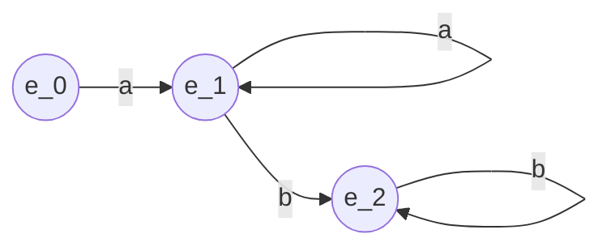

$P=\lbrace e_0 \rightarrow ae_1,\space e_1 \rightarrow ae_1\space |\space ce_2,\space e_2\rightarrow be_2\rbrace$

17. Para la especificación dada dibuje el árbol de derivación para: $a \space a \space c \space b \space b$​ 

    Realizado por: **Romina Palmieri**
    
    $P = \lbrace e_0 \rightarrow  a e_1, e_1 \rightarrow  a e_1 | c e_2, e_2 \rightarrow b e_2 \rbrace$​
    
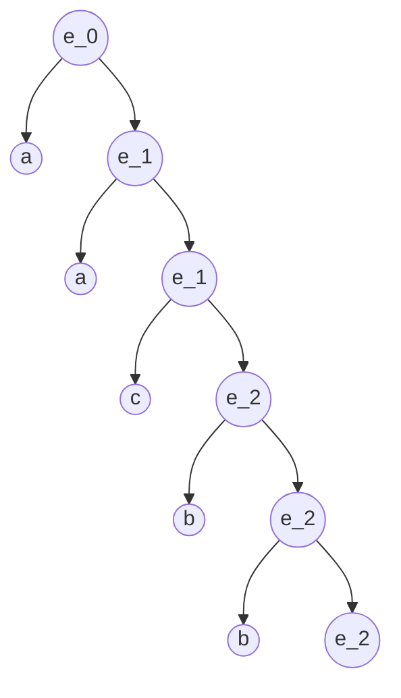

   Realizado por: **Gustavo Arauz**
    
   $P = \lbrace e_0 \rightarrow  a e_1, e_1 \rightarrow  a e_1 | c e_2, e_2 \rightarrow b e_2 | \lambda \rbrace$

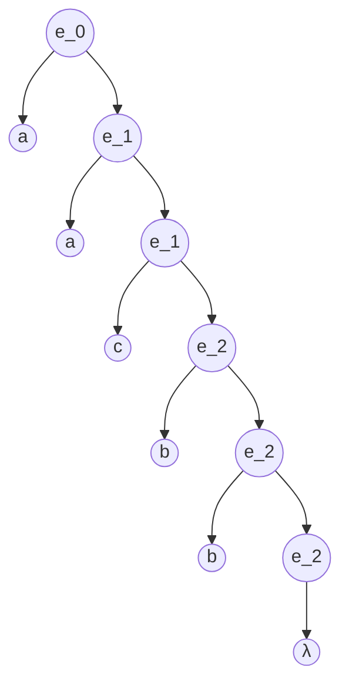
18. *Sea la cuádrupla es* $G = (\lbrace S,A,B\rbrace, \lbrace0, 1\rbrace, P, S)$​ *con el siguiente conjunto de producciones, indique 3 cadenas válidas diferentes y dibuje los respectivos árboles de derivación:* 

    $P : \lbrace S \rightarrow A1B, A \rightarrow 0A | λ, B \rightarrow 0B | 1B | λ \rbrace$

    1.
    
    $\underline{S}\rightarrow \underline{A}1B \rightarrow \lambda1\underline{B} \rightarrow \lambda1\lambda \rightarrow 1$

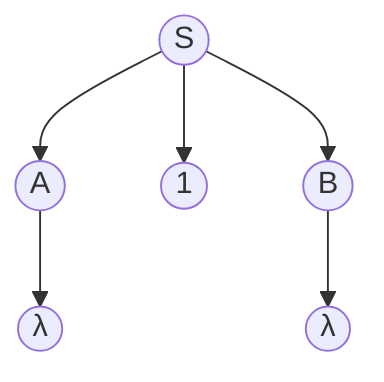

​	2.

​	$\underline{S}\rightarrow \underline{A}1B \rightarrow 0\underline{A}1B \rightarrow 0\lambda1\underline{B} \rightarrow 0\lambda10\underline{B} \rightarrow 0\lambda10\lambda \rightarrow 010$

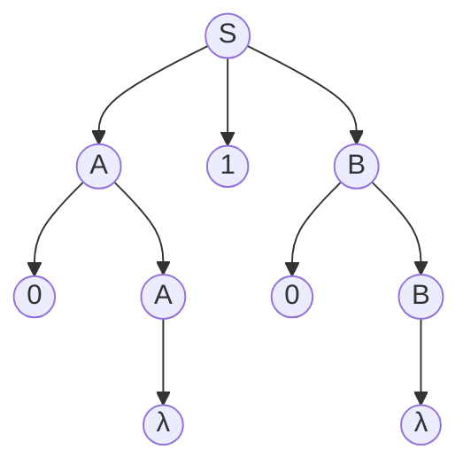

​	3.	

​	$S\rightarrow \underline{A}1B \rightarrow 0\underline{A}1B \rightarrow 00\underline{A}1B \rightarrow 00\lambda1\underline{B} \rightarrow 00\lambda10\underline{B} \rightarrow 00\lambda101\underline{B} \rightarrow 00\lambda101\lambda \rightarrow 00101$​

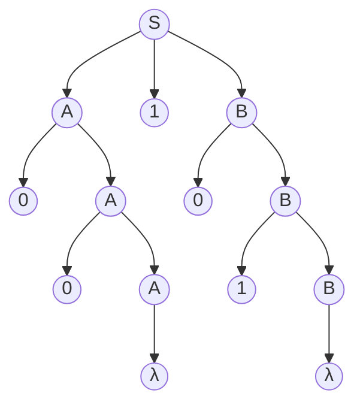

19. Dibuje el árbol de derivación para la cadena $z = (x + y) * z$ correspondiente a la siguiente gramática: 

    $ASSIGN \rightarrow ID\space  {}'{=}'\space  EXPR$ 

    $ID \rightarrow {}'{x}'\space |\space {}'{y}' \space |\space {}'{z}'$ 

    $EXPR \rightarrow ID\space {}'{+}'\space EXPR\space |\space EXPR \space {}'{*}' \space ID\space |\space {}'{(}' \space EXPR\space {}'{)}' |\space ID$​

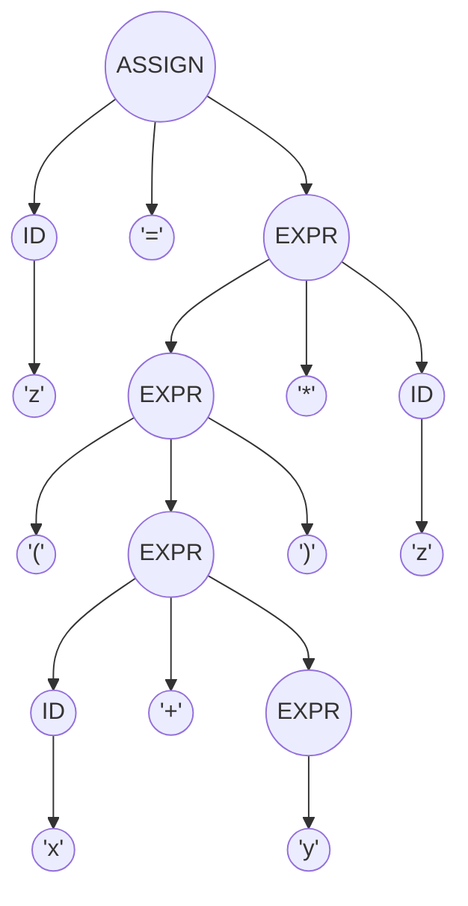

20. *Verificar si la siguiente gramática, genera cadenas ambiguas, en cuyo caso dar los ejemplos.*

    $G = (\lbrace {}'{a}', {}'{+}', {}'{*}', {}'{(}', {}'{)}'\rbrace, \lbrace S\rbrace, S, P)$ 

    $P = \lbrace S := {}'{a}',\space S := S \space {}'{+}'\space S,\space S := S * S,\space S := S\rbrace$​
    
    Cadena ambigua generada: $a+a*a$

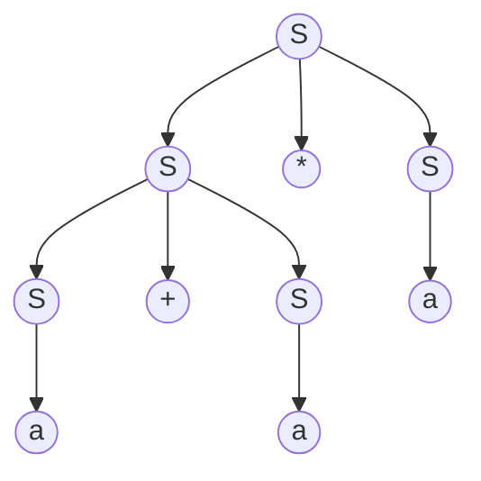

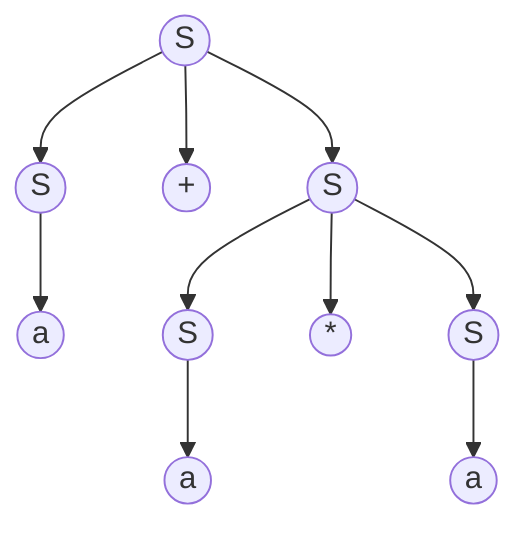

21. Construya una gramática regular no ambigua que genere todas las cadenas de $0$ y $1$ en las cuales los $0$, si aparecen, lo hacen en grupos individuales de a tres. 

    Ej. cadenas que pertenecen al lenguaje Ej. cadenas que NO pertenecen al lenguaje $1,11111, 000, 1000, 1110001000$                          $0, 00, 11000011, 000000, 000100$​ 

    Realizado por: **Marcela Vargas**

    Para realizar **<u>gramática regular</u>** debemos recordar de la teoría que es una *REGULAR*: son las llamadas gramáticas de tipo 3 o Regulares, deben ser lineales a Derecha o a Izquierda.

    - **Lineales por Izquierda**

      $P = \lbrace (S::=λ) o (A::=Ba) o (A::=a)/ A,B, \in \Sigma_N, a \in \Sigma_T\rbrace$

    - **Lineales por Derecha**

      $P=\lbrace (S::=λ) o (A::=aB) o (A::=a)/A,B\in \Sigma_N, a\in \Sigma_T \rbrace$

    Es decir, que las producciones de nuestras gramática

    También pide en el ejercicio que la gramática *<u>no sea ambigua</u>*

    *Gramática ambigua*: Una gramática es ambigua si tiene al menos una sentencia ambigua. Una sentencia es ambigua si tiene más de una derivación o árbol de derivación.

    En nuestro caso, la gramática resultante debe ser *NO AMBIGUA*, es decir, para llegar a una palabra aceptada, esta *NO DEBE* tener más de un árbol de derivación.

    Con esta base teórica sería incorrecto colocar una producción del tipo $S \rightarrow 000A$.

    Sino lo que debemos hacer es una producción que al ingresar un 0, "redirigir" a colocar un 0 más y este a su vez un 0 más. Luego, asegurarnos con otra producción que luego de los 3 ceros deberá aceptar si o si un 1.

    Entonces, va quedando:

    $S \rightarrow 0A$

    $A \rightarrow 0B$

    $B \rightarrow 0C \space | \space 0$  acá la producción de un solo 0 para poder generar la palabra 000

    $C \rightarrow 1S$

    Pero esto está incompleto nos falta las producciones que generen muchos 1, y que permitan ingresar los número 1 en las palabra de nuestra gramática.

    $S \rightarrow 1S \space | \space \lambda$

    ***RESULTADO FINAL***

    $S \rightarrow 1S \space | \space 0A \space | \space \lambda$

    $A \rightarrow 0B$

    $B \rightarrow 0C \space | \space 0$

    $C \ rightarrow 1S$

    ---

    ***Bibliografía***: 

    - Diapositivas de la materia Lenguajes Formales, tipos de Gramática, Ambigüedad.
    - Libro Lenguajes Gramáticas y Autómatas de Isasi, Martinez y Borrajo - Capítulo 2 Lenguajes y Gramáticas Formales, pág. 18 a 20

22. *Escriba las reglas de producción para la gramática* $G_1$, *no ambigua, que reconoce el lenguaje* $L_1$. $G_1 = (\lbrace A\rbrace, \lbrace a, b, c\rbrace, P, S_1)$ $L_1 = \lbrace wcw^{R} / w \in \lbrace a | b\rbrace\and R > 0\rbrace$ 

    Palabras que se pueden formar con el lenguaje $L_1$ 

    $aca$

    $bcb$

    $aacaa$

    $abcba$

    $abbcbba$

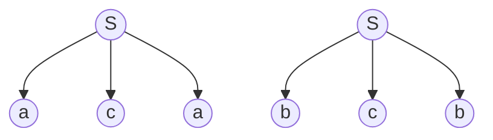

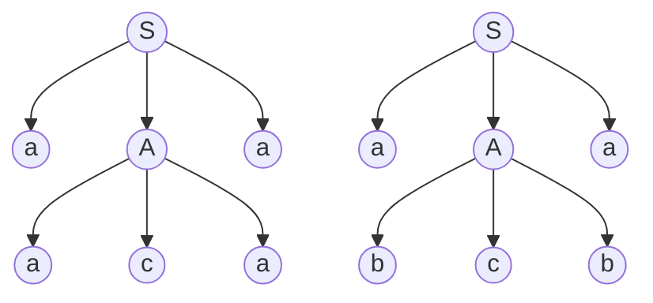

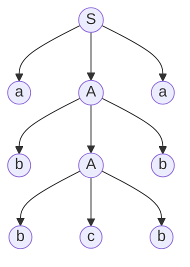

   Por lo tanto, el axioma $S_1$ debe ser:

   $S_1 \rightarrow aSa \space | \space bSb \space | \space A$

   y el símbolo no terminal debe generar:

​	$A \rightarrow c$

   Otras opciones válidas son:

   $S_1 \rightarrow aAa \space | \space bAb$

   $A \rightarrow aAa \space | \space bAb \space | \space c$

   o:

   $S_1 \rightarrow aAa \space | bAb$

   $A \space aSa \space | \space bSb \space | \space c$

23. Completar las reglas de producción para la gramática. 

    Sea $G = (\lbrace A, B\rbrace, \lbrace a\rbrace, P, S)$ una gramática regular lineal a derecha que genera $L = \lbrace a^{2n} / n ≥ 0\rbrace$

    $S\rightarrow ε$                                                                           $S \rightarrow ?$

    $A\rightarrow aB$                                                                      $A\rightarrow ? $

    $B\rightarrow ?$​

    ---

    Realizado por: **Julio Monetti**

    Una particularidad de este ejercicio: observar que en el lado derecho de las producciones el símbolo **NO** terminal aparece a la derecha del símbolo terminal, con la forma $A \rightarrow aB$ o $A \rightarrow a$.

    Con las reglas de producciones hay que lograr obtener cadenas que tengan una cantidad par de $a$ de acuerdo a lo que especifica la definición formal del lenguaje.

    Luego, es necesario obtener alguna estrategia para completar las reglas. Por ejemplo, y comenzando con la derivación de **$S$**, podríamos indicar que desde la derivación del axioma **$S$** se debe generar, lógicamente, una **combinación par** de símbolos $a$. Con lo cual, se derivamos $S \rightarrow aA$, significa que $A$  deberá derivar en una combinación impar de letras $A$. A continuación, en ambas reglas para derivar $A$ de la consigna, se deb asegurar que derivan en una cantidad impar de $a$. Una regla es directa $A \rightarrow a$, y en la otra regla interviene como símbolo a la derecha $B$ Derivando $A \rightarrow aB$, necesitando que $B$ también derive en una **cantidad de elementos pares de a**: $B \rightarrow aA$ (por derivar $A$ en una cantidad impar de $a$). Luego, queda:

    $S\rightarrow \lambda$                                                                           $S \rightarrow aA$

    $A\rightarrow aB$                                                                       $A\rightarrow a$

    $B\rightarrow aA$

24. *Completar las reglas de producción para la gramática.* 

    Sea $G = \lbrace \lbrace A, B, C\rbrace, \lbrace0, 1, 2, 3 \rbrace, P, S\rbrace$ *que genera*: $L = \lbrace 0^i 1^{i+k} 2^k 3^{n+1} / i, k, n ≥ 0 \rbrace$ 

    $S\rightarrow ABC$                                                                 $S\rightarrow ?$ 

    $S\rightarrow BC$                                                                    $S\rightarrow ?$ 

    $A\rightarrow 0A1$                                                                  $A\rightarrow ?$ 

    $B\rightarrow 1B2$                                                                  $B\rightarrow ?$ 

    $C\rightarrow 3C$                                                                    $C\rightarrow ?$ 

    Algunas cadenas generadas por $L$:

    |                       | $0^i$ | $1^{i+k}$ | $2^k$ | $3^{n+1}$ |
    | --------------------- | ----- | --------- | ----- | --------- |
    | $i = 0, k = 0, n = 0$ | λ     | λ         | λ     | 3         |
    | $i = 0, k = 1, n = 0$ | λ     | 1         | 2     | 3         |
    | $i = 0, k = 0, n = 1$ | λ     | λ         | λ     | 33        |
    | $i = 0, k = 1, n = 1$ | λ     | 1         | 2     | 33        |
    | $i = 1, k = 0, n = 0$ | 0     | 1         | λ     | 3         |
    | $i = 1, k = 1, n = 0$ | 0     | 11        | 2     | 3         |
    | $i = 1, k = 1, n = 1$ | 0     | 11        | 2     | 33        |

    Para generar la cadena donde $i = 0, k = 0$ y $n = 0$ el axioma $S$ debe derivar en el símbolo no terminal $C$ para poder poner un o varios $3$. Por lo tanto, $C$ debe derivar en $3$.

    $C \rightarrow 3$

    Además, los símbolos no terminales $A$ y $B$ deben derivar en el símbolo terminal $λ$.

    Las reglas de producción quedarían:$S\rightarrow ABC$                                                                 $S \rightarrow ABC$                                                                $S\rightarrow C$ 

    $S\rightarrow BC$                                                                   $S\rightarrow ?$ 

    $A\rightarrow 0A1$                                                                 $A\rightarrow λ$ 

    $B\rightarrow 1B2$                                                                 $B\rightarrow λ$ 

    $C\rightarrow 3C$                                                                   $C\rightarrow 3$

25. Dibuje el diagrama sintáctico equivalente: 

    `<ModDeclaration>::= <MODULE> 'ident' ['priority'] ';' {<Import>} <Block>  'ident''.' `

    

26. Exprese el equivalente del siguiente diagrama sintáctico, en notación EBNF: **Declaration**

    

    Realizado por: ***Romina Palmieri***

    **Respuesta**

    `<Declaration>::='('[['VAR']<FormalType>{','['VAR']<FormalType>]')'[':'<Qualildent>]`

    **Explicación**:

    + Buscamos representar la misma gramática del diagrama sintáctico del enunciado pero con la notación *EBNF*.

    + Los símbolos terminales y no terminales tiene la siguientes equivalencias en relación a la forma de ser representados entre los elementos del diagrama sintáctico y la notación *BNF*

      

    + La notación *EBNF* es una extensión de la *BNF*. A la barra "|", que representa una "alternativa" entre símbolos en la notación *BNF*, se agregan los siguientes elementos en *EBNF*.

      + llaves { } para representar las repeticiones del diagrama indicadas por las flechas,
      + corchetes [ ] para representar opcionalidad,
      + y paréntesis ( ) para indicar agrupaciones.

27. *Dibuje el diagrama sintáctico equivalente*:

    `<list> ::= <alternative> { ‘|’ <alternative> }[ <else>  ] `

    

28. *Exprese el equivalente del siguiente diagrama sintáctico, en notación EBNF y BNF:*

    **Named constant** 

    

    ***EBNF***:

    `Named constant::="const"{<Identifier>"="["+"|"-"]<Identifier>}+`

    ***BNF***:
    
    Para convertir esta expresión a BNF (Backus-Naur Form), necesitamos eliminar las notaciones de repetición `{}` y opción `[]` que son características de EBNF (Extended Backus-Naur Form). La conversión expresión resultante es:

    `<Named constant> ::= "const" <Identifier List>`
`<Identifier List> ::= <Identifier> "=" <Sign> <Identifier>`
    `<Sign> ::= "+" | "-" | <empty>`
    
    En BNF, `<Named constant>` se define como `"const"` seguido de una lista de identificadores `<Identifier List>`. `<Identifier List>` puede ser un solo identificador `<Identifier>` o una secuencia de identificadores. `<Sign>` puede ser `"+"`, `"-"` o vacío (representado por `<empty>`), lo que indica que el signo es opcional.
    
    *Diagrama alternativo*

    

29. Re-escriba la expresión en notaciones pre y post fija. Dibuje el árbol de *evaluación*.

    Realizado por: **Gustavo Arauz**

    $(x_1 + x_2) – x_3 + (x_4 / x_5 + x_6)$

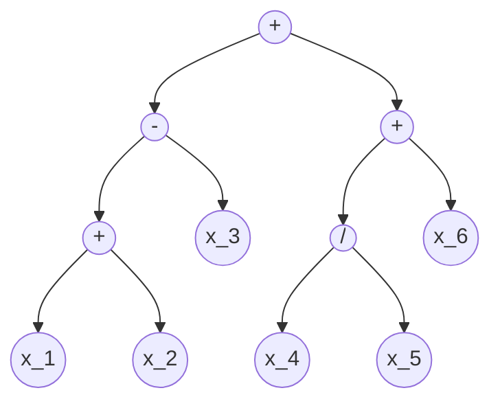

​	**Prefija**: $+-+x_1x_2x_3+/x_4x_5x_6$

​	**Postfija**:  $x_1x_2+x_3-x_4x_5/x_6++$

---

​	Realizado por: **Romina Palmieri**

​	Para escribir la expresión a modo prefijo si tenemos una expresión simple tipo $x_1 + x_2$, se coloca el símbolo al inicio y luego ambos factores, por ej: $+x_1x_2$: Notar que se deben tener en cuenta paréntesis.

​	**Prefija**: $+-+x_1x_2x_3+/x_4x_5x_6$

​	**Postfija**: $x_1x_2+x_3-x_4x_5/x_6++$

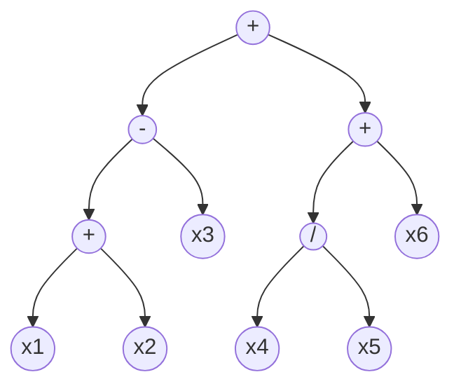

30. *Re-escriba las expresiones en notaciones pre y post fija. Dibuje el árbol de evaluación.* 

    $a + b * c / d$

    $a * (b + c / 3) * d – k$ 

    $(b / 2 + b * b – 4 * x – 2 * y) / (2 + a)$

    *Ejercicio* $a + b * c / d$​
    
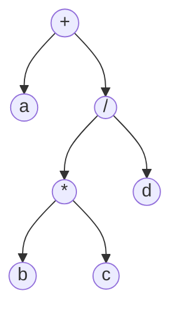

​	**Prefija**: $+a/*bcd$

​	**Postfija**:  $abc*d/+$

​	*Ejercicio* $a * (b + c / 3) * d – k$

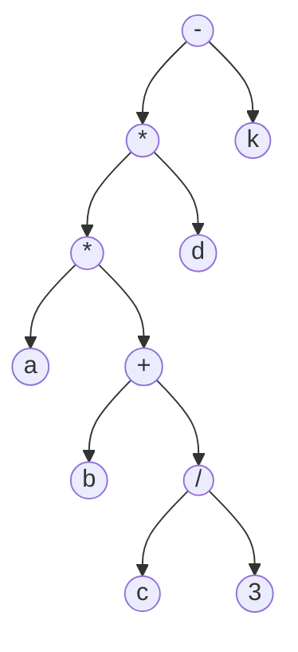

​	**Prefija**: $-**a+b/c3dk$

​	**Postfija**: $abc3/+*d*k-$

​	*Ejercicio* $(b / 2 + b * b – 4 * x – 2 * y) / (2 + a)$

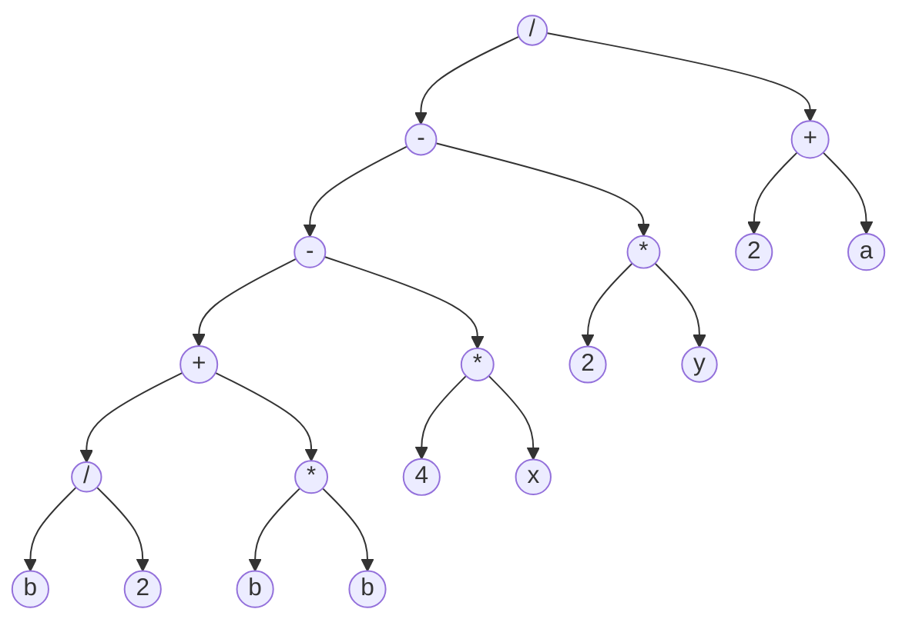

​	**Prefija**: $/--+/b2*bb*4x*2y+2a$

​	**Postfija**: $b2/bb*+4x*-2y*-2a+/$
