## TRABAJO PRÁCTICO 

# B. GRAMÁTICAS Y LENGUAJES 

13. Defina los conjuntos $P$ de la gram√°tica de $G =  (\lbrace S, A, B, C\rbrace, \lbrace0, 1\rbrace, S, P )$ que reconozca: 

    $0 0 1 0 1 0$‚Äã‚Äã 

    Realizado por: **Mauricio Fariello**

    **Respuesta**:

    $P = \lbrace S \rightarrow A10, A \rightarrow B10, B \rightarrow C0, C \rightarrow 0\rbrace$

    *Explicación*:

    + Se debe crear el conjunto $P$ formado por las producciones que generen la secuencia de caracteres $001010$.
    + Estas producciones o reglas de derivación son aplicadas de la siguiente manera para reconocer la cadena:
      + Partimos del axioma "$S$" aplicando la regla de producción $S \rightarrow A10$ produciendo $A10$.
      + Aplicamos a ese resultado la regla $A \rightarrow B10$ y obtenemos $B1010$.
      + Luego aplicamos $B \rightarrow C0$ produciendo $C01010$.
      + Luego aplicamos $C \rightarrow 0$ reconociendo así la cadena solicitada $001010$​.

    ---

    $P = \lbrace S\rightarrow 0A0,\space A\rightarrow 01B, \space B\rightarrow 0C ,\space C\rightarrow 1\rbrace$

14. Defina los conjuntos $P$ de la gram√°tica de $G = ( \lbrace S, A, B, C\rbrace, \lbrace0, 1\rbrace, S, P )$ que reconozca: 

    $0 0 0 1 0 1$‚Äã 

    $P = \lbrace S \rightarrow A01, A \rightarrow B1, B \rightarrow C0, C \rightarrow C0 | 0 \rbrace$

    $S \rightarrow \underline{A}01 \rightarrow \underline{B}101 \rightarrow \underline{C}0101 \rightarrow \underline{C}00101 \rightarrow 000101$

15. Definir las reglas de una gramática *Tipo 2* en base a la especificación dada, que reconozca el lenguaje: 

    $L1 = \lbrace w^n cw^n / w \in \lbrace a, b\rbrace n > 0\rbrace$

    $G1 = (\lbrace A, S\rbrace, \lbrace a, b, c\rbrace, P, S)$‚Äã‚Äã 

    Realizado por: **Oscar León**

    a. Al definir una gramática, lo primero es analizar "la forma" de la cadena que se debe generar. En este caso, a izquierda y derecha de $c$ debe aparecer la misma subcadena, con la misma cantidad de símbolos $n>0$.

    b. La cantidad de $w$ está formada por los símbolos $a$ y $b$ según indica en la restricción $w \in \lbrace a,b\rbrace$.

    c. Se definen los símbolos terminales $\lbrace a,b,c\rbrace$ y no-terminales $\lbrace A,S \rbrace$, el conjunto $P$ debe incluir esos dos símbolos no-terminales.

    d. Finalmente sólo queda escribir el conjunto $P$ de reglas de producción.

    Definir las reglas de producción del conjunto $P$ es un proceso similar a diseñar un algoritmo, es decir, que hay que  definir reglas que generen lo que se busca obtener como resultado. 

    En este caso, vamos a definir el axioma de modo tal que garantice que a izquierda y derecha de $c$ genere la misma subcadena.

    $S \rightarrow a\space S \space a\space |\space b\space S\space b$

    Este axioma presenta recursión infinita.

    Por lo tanto es necesario plantear esta segunda versión de $S$, que no sea recursiva.

    $S \rightarrow a\space A \space a\space |\space b\space A\space b$

    $A \rightarrow c$
    
    Ejemplo de √°rbol generador

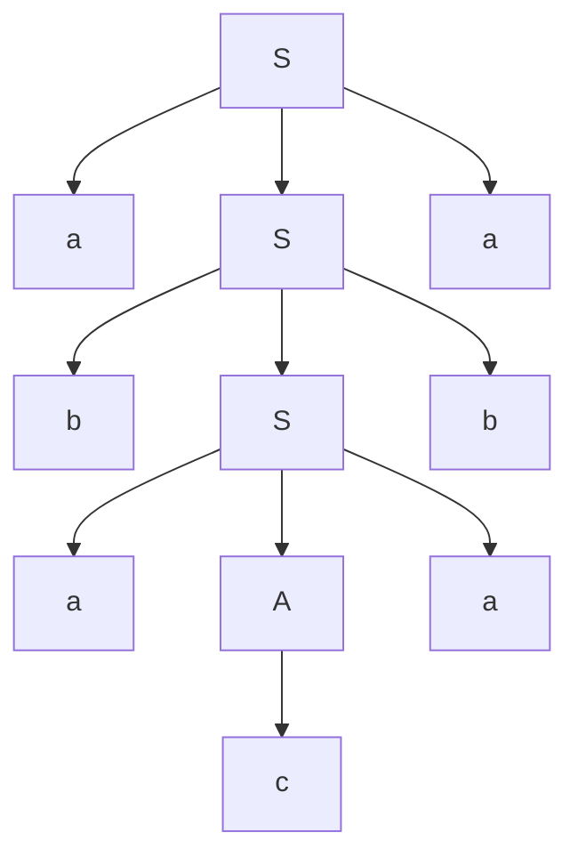
```mermaid
graph TD;
        A[S] --> B[a];
        A[S] --> D[S];
        A[S] --> C[a];
        D[S] --> E[b];
        D[S] --> F[S];
        D[S] --> G[b];
        F[S] --> H[a];
        F[S] --> I[A];
        F[S] --> J[a];
        I[A] --> K[c];
```

Cadena generada $a\space b\space a\space c\space a\space b\space a$

16. Defina las reglas de producción para el lenguaje: $L1 = \lbrace a^{n}\space c \space b^{m} / n > 0 \space \and\space m ≥ 0 \rbrace$ 

    

    | n    | m    |               |
    | ---- | ---- | ------------- |
    | 0    | 0    | $a^0cb^0=c$   |
    | 1    | 0    | $a^1cb^0=ac$  |
    | 0    | 1    | $a^0cb^1=cb$  |
    | 1    | 1    | $a^1cb^1=acb$ |

    $S\rightarrow c\space|\space AcB$

    $A\rightarrow \lambda\space|\space a\space |\space aA$

    $B\rightarrow \lambda\space|\space b\space |\space bB$‚Äã

    ---

    como *Autómata Infinito*

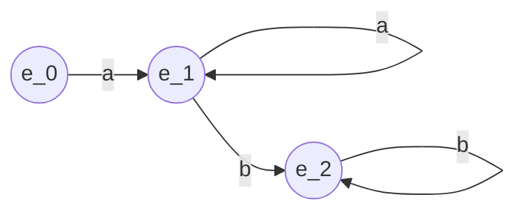
```mermaid
    flowchart LR
    	A((e_0)) -- a --> B((e_1))
    	B((e_1)) -- a --> B((e_1))
    	B((e_1)) -- b --> C((e_2))
    	C((e_2)) -- b --> C((e_2))
```

$P=\lbrace e_0 \rightarrow ae_1,\space e_1 \rightarrow ae_1\space |\space ce_2,\space e_2\rightarrow be_2\rbrace$

17. Para la especificación dada dibuje el árbol de derivación para: $a \space a \space c \space b \space b$​ 

    Realizado por: **Romina Palmieri**
    
    $P = \lbrace e0 \rightarrow  a e1, e1 \rightarrow  a e1 | c e2, e2 \rightarrow b e2 | \lambda \rbrace$

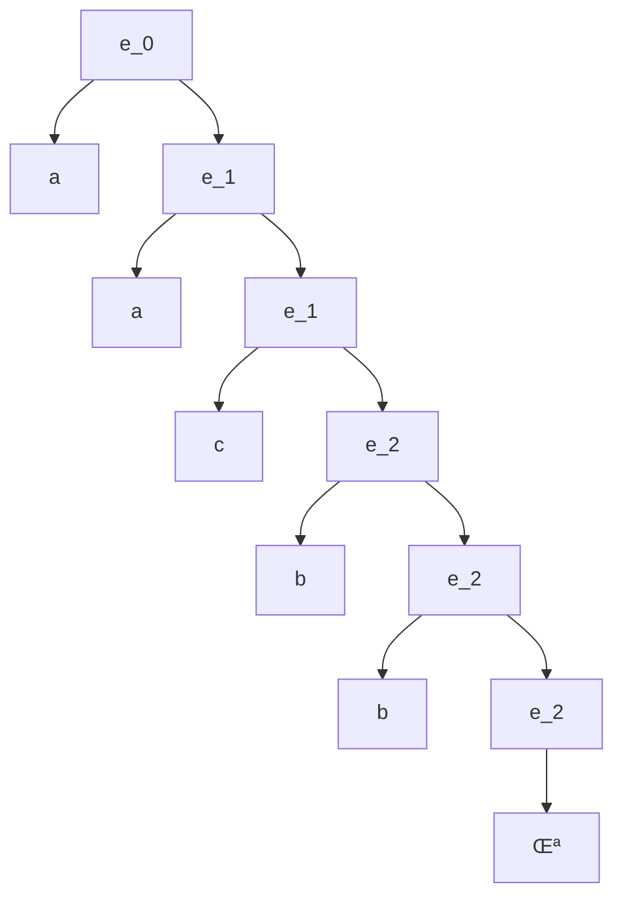
```mermaid
graph TD;
	A[e_0] --> B[a];
	A[e_0] --> C[e_1];
	C[e_1] --> D[a];
	C[e_1] --> E[e_1];
	E[e_1] --> F[c];
	E[e_1] --> G[e_2];
	G[e_2] --> H[b];
	G[e_2] --> I[e_2];
	I[e_2] --> J[b];
	I[e_2] --> K[e_2];
	K[e_2] --> L[λ]
```
18. *Sea la cuádrupla es* $G = (\lbrace S,A,B\rbrace, \lbrace0, 1\rbrace, P, S)$​ *con el siguiente conjunto de producciones, indique 3 cadenas válidas diferentes y dibuje los respectivos árboles de derivación:* 

    1.

    $P : \lbrace S \rightarrow A1B, A \rightarrow 0A | λ, B \rightarrow 0B | 1B | λ \rbrace$​
    
    $\underline{S}\rightarrow \underline{A}1B \rightarrow \lambda1\underline{B}\rightarrow \rightarrow \lambda1\lambda \rightarrow 1$

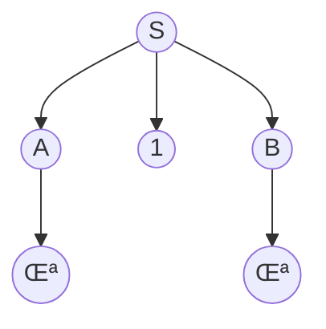
```mermaid
	graph TD;
	A((S)) --> B((A));
	A((S)) --> C((1));
	A((S)) --> D((B));
	B((A)) --> E((λ));
	D((B)) --> F((λ));
```

‚Äã	2.

‚Äã	3.

19. Dibuje el árbol de derivación para la cadena $z = (x + y) * z$ correspondiente a la siguiente gramática: 

    $ASSIGN \rightarrow ID\space  {}'{=}'\space  EXPR$ 

    $ID \rightarrow {}'{x}'\space |\space {}'{y}' \space |\space {}'{z}'$ 

    $EXPR \rightarrow ID\space {}'{+}'\space EXPR\space |\space EXPR \space {}'{*}' \space ID\space |\space {}'{(}' \space EXPR\space {}'{)}' |\space ID$‚Äã

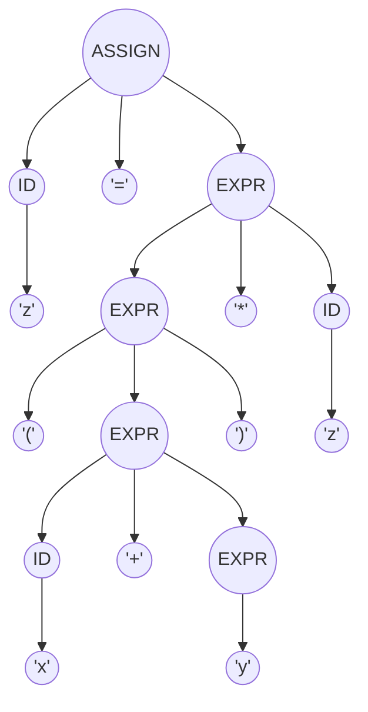
```mermaid
    graph TD
    	A((ASSIGN)) --> B((ID));
    	A((ASSIGN)) --> C(('='));
    	A((ASSIGN)) --> D((EXPR));
    	B((ID)) --> E(('z'));
    	D((EXPR)) --> F((EXPR));
    	D((EXPR)) --> G(('*'));
    	D((EXPR)) --> H((ID));
    	F((EXPR)) --> I(("'('"));
    	F((EXPR)) --> J((EXPR));
    	F((EXPR)) --> K(("')'"));
    	J((EXPR)) --> L((ID));
    	J((EXPR)) --> M(('+'));
    	J((EXPR)) --> N((EXPR));
    	L((ID)) --> O(('x'));
    	N((EXPR)) --> P(('y'));
    	H((ID)) --> Q(('z'));
```


20. *Verificar si la siguiente gram√°tica, genera cadenas ambiguas, en cuyo caso dar los ejemplos.*

    $G = (\lbrace {}'{a}', {}'{+}', {}'{*}', {}'{(}', {}'{)}'\rbrace, \lbrace S\rbrace, S, P)$ 

    $P = \lbrace S := {}'{a}',\space S := S \space {}'{+}'\space S,\space S := S * S,\space S := S\rbrace$‚Äã
    
    Cadena ambigua generada: $a+a*a$

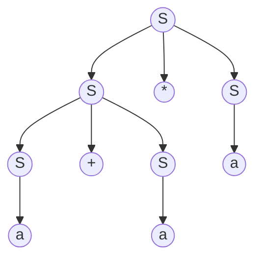
```mermaid
    graph TD
    	S((S))	-->	S1((S))
    	S((S))	-->	Ti((*))
    	S((S))	-->	S2((S))
    	S1((S))	--> S3((S))
    	S1((S))	-->	Pl((+))
    	S1((S))	-->	S4((S))
    	S2((S))	--> A3((a))
    	S3((S))	--> A1((a))
    	S4((S))	-->	A2((a))
```


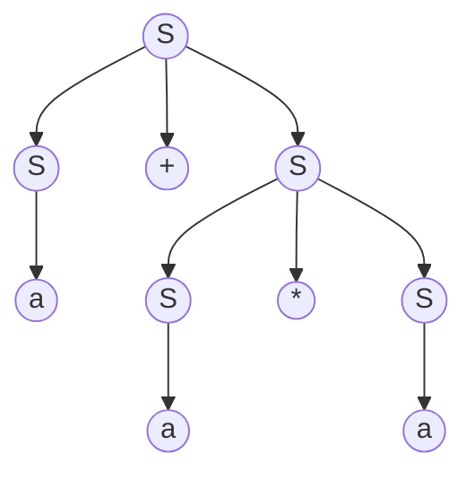
```mermaid
    graph TD
    	S((S))	-->	S1((S))
    	S1((S))	--> A1((a))
    	S((S))	-->	Pl((+))
    	S((S))	-->	S2((S))
    	S2((S))	-->	S3((S))
    	S2((S))	-->	Ti((*))
    	S2((S))	-->	S4((S))
    	S3((S))	--> A2((a))
    	S4((S))	-->	A3((a))
```

21. Construya una gram√°tica regular no ambigua que genere todas las cadenas de $0$ y $1$ en las cuales los $0$, si aparecen, lo hacen en grupos individuales de a tres. 

    Ej. cadenas que pertenecen al lenguaje Ej. cadenas que NO pertenecen al lenguaje $1,11111, 000, 1000, 1110001000$                          $0, 00, 11000011, 000000, 000100$‚Äã 

    Realizado por: **Marcela Vargas**

22. *Escriba las reglas de producción para la gramática* $G_1$, *no ambigua, que reconoce el lenguaje* $L_1$. $G_1 = (\lbrace A\rbrace, \lbrace a, b, c\rbrace, P, S_1)$ $L_1 = \lbrace wcw^{R} / w \in \lbrace a | b\rbrace y R > 0\rbrace$​ 

    

23. Completar las reglas de producción para la gramática. 

    Realizado por: **Julio Monetti**

    Sea $G = (\lbrace A, B\rbrace, \lbrace a\rbrace, P, S)$ una gram√°tica regular lineal a derecha que genera $L = \lbrace a^{2n} / n ‚â• 0\rbrace$

    $S\rightarrow ε$                                                                           $S \rightarrow ?$

    $A\rightarrow aB$                                                                      $A\rightarrow ? $

    $B\rightarrow ?$

24. *Completar las reglas de producción para la gramática.* 

    Sea $G = ({A, B, C}, {0, 1, 2, 3}, P, S)$ *que genera*: $L = {0^i 1^{i+k} 2^k 3^{n+1} / i, k, n ‚â• 0 }$ 

    $S\rightarrow ABC$                                                                 $S\rightarrow ?$ 

    $S\rightarrow BC$                                                                    $S\rightarrow ?$ 

    $A\rightarrow 0A1$                                                                  $A\rightarrow ?$ 

    $B\rightarrow 1B2$                                                                  $B\rightarrow ?$ 

    $C\rightarrow 3C$                                                                    $C\rightarrow ?$ 

25. Dibuje el diagrama sint√°ctico equivalente: 

    `<ModDeclaration>::= <MODULE> 'ident' ['priority'] ';' {<Import>} <Block>  'ident''.' `

    

26. Exprese el equivalente del siguiente diagrama sintáctico, en notación EBNF: **Declaration**

    

    Realizado por: ***Romina Palmieri***

    **Respuesta**

    `<Declaration>::='('[['VAR']<FormalType>{','['VAR']<FormalType>]')'[':'<Qualildent>]`

    **Explicación**:

    + Buscamos representar la misma gramática del diagrama sintáctico del enunciado pero con la notación *EBNF*.

    + Los símbolos terminales y no terminales tiene la siguientes equivalencias en relación a la forma de ser representados entre los elementos del diagrama sintáctico y la notación *BNF*

      

    + La notación *EBNF* es una extensión de la *BNF*. A la barra "|", que representa una "alternativa" entre símbolos en la notación *BNF*, se agregan los siguientes elementos en *EBNF*.

      + llaves { } para representar las repeticiones del diagrama indicadas por las flechas,
      + corchetes [ ] para representar opcionalidad,
      + y paréntesis ( ) para indicar agrupaciones.

27. *Dibuje el diagrama sint√°ctico equivalente*:

    `<list> ::= <alternative> { ‘|’ <alternative> }[ <else>  ] `

    

28. *Exprese el equivalente del siguiente diagrama sintáctico, en notación EBNF y BNF:*

    **Named constant** 

    

    ***BNF***:

    La expresión en EBNF que proporcionaste es:

    ```ebnf
    Named constant ::= "const" {<Identifier> "=" ["+" | "-"] <Identifier>}+
    ```

    Para convertir esta expresión a BNF (Backus-Naur Form), necesitamos eliminar las notaciones de repetición `{}` y opción `[]` que son características de EBNF (Extended Backus-Naur Form). Aquí está la conversión:

    ```bnf
    <Named constant> ::= "const" <Identifier List>
    <Identifier List> ::= <Identifier> "=" <Sign> <Identifier> | <Identifier> "=" <Sign> <Identifier> <Identifier List>
    <Sign> ::= "+" | "-" | <empty>
    ```

    En esta versión BNF, `<Named constant>` se define como `"const"` seguido de una lista de identificadores `<Identifier List>`. `<Identifier List>` puede ser un solo identificador o una secuencia de identificadores. `<Sign>` puede ser `"+"`, `"-"` o vacío (representado por `<empty>`), lo que indica que el signo es opcional.

    Espero que esto te ayude. Si tienes m√°s preguntas, no dudes en preguntar. üòä

    ‚Äã              

    `Named constant::="const"`

    ***EBNF***:

    `Named constant::="const"{<Identifier>"="["+"|"-"]<Identifier>}+`

    

29. Re-escriba la expresión en notaciones pre y post fija. Dibuje el árbol de *evaluación*.

    Realizado por: **Gustavo Arauz**

    $(x_1 + x_2) – x_3 + (x_4 / x_5 + x_6)$

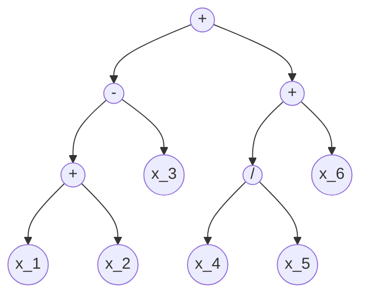
```mermaid
    graph TD
    	Re1(("-"))	-->	Su1((+))
    	Re1(("-"))	-->	X3((x_3))
    	Su1((+))	-->	X1((x_1))
    	Su1((+))	-->	X2((x_2))
    	Su2((+))	--> Re1(("-"))
    	Su2((+))	-->	Su3((+))
    	Su3((+))	-->	Di1((/))
    	Su3((+))	-->	X6((x_6))
    	Di1((/))	-->	X4((x_4))
    	Di1((/))	-->	X5((x_5))
```

‚Äã	**Prefija**: $+-+x_1x_2x_3+/x_4x_5x_6$

‚Äã	**Postfija**:  $x_1x_2+x_3-x_4x_5/x_6++$

---

‚Äã	Realizado por: **Romina Palmieri**

​	Para escribir la expresión a modo prefijo si tenemos una expresión simple tipo $x_1 + x_2$, se coloca el símbolo al inicio y luego ambos factores, por ej: $+x_1x_2$: Notar que se deben tener en cuenta paréntesis.

‚Äã	**Prefija**: $+-+x_1x_2x_3+/x_4x_5x_6$

‚Äã	**Postfija**: $x_1x_2+x_3-x_4x_5/x_6++$


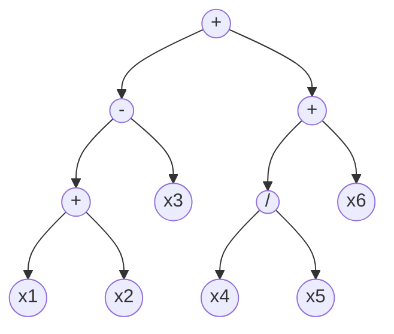
```mermaid
    graph TD
    	Re1(("-"))	-->	Su1((+))
    	Re1(("-"))	-->	X3((x3))
    	Su1((+))	-->	X1((x1))
    	Su1((+))	-->	X2((x2))
    	Su2((+))	--> Re1(("-"))
    	Su2((+))	-->	Su3((+))
    	Su3((+))	-->	Di1((/))
    	Su3((+))	-->	X6((x6))
    	Di1((/))	-->	X4((x4))
    	Di1((/))	-->	X5((x5))
```

30. *Re-escriba las expresiones en notaciones pre y post fija. Dibuje el árbol de evaluación.* 

    $a + b * c / d$

    $a * (b + c / 3) * d – k$ 

    $(b / 2 + b * b – 4 * x – 2 * y) / (2 + a)$

    *Ejercicio* $a + b * c / d$‚Äã
    
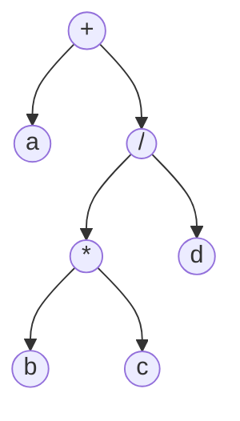
```mermaid
	graph TD
    		Su((+))-->A((a))
    		Su((+))-->Di((/))
    		Di((/))-->Mu((*))
    		Di((/))-->D((d))
    		Mu((*))-->B((b))
    		Mu((*))-->C((c))
```

‚Äã	**Prefija**: $+a/*bcd$

‚Äã	**Postfija**:  $abc*d/+$

​	*Ejercicio* $a * (b + c / 3) * d – k$

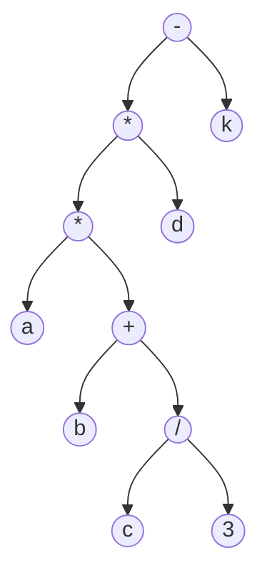
```mermaid
    graph TD
    	Mu1((*))-->A((a))
    	Mu1((*))-->Su((+))
    	Su((+))-->B((b))
    	Su((+))-->Di((/))
    	Di((/))-->C((c))
    	Di((/))-->Tr((3))
    	Mu2((*))-->Mu1((*))
    	Mu2((*))-->D((d))
    	Re(("-"))-->Mu2((*))
    	Re(("-"))-->K((k))
```

‚Äã	**Prefija**: $-**a+b/c3dk$

‚Äã	**Postfija**: $abc3/+*d*k-$

​	*Ejercicio* $(b / 2 + b * b – 4 * x – 2 * y) / (2 + a)$

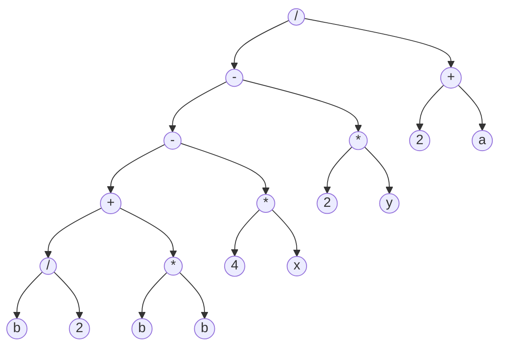
```mermaid
    graph TD
    	Su1((+))-->Di1((/))
    	Su1((+))-->Mu1((*))
    	Mu1((*))-->B2((b))
    	Mu1((*))-->B3((b))
    	Di1((/))-->B((b))
    	Di1((/))-->Do((2))
    	Re1(("-"))-->Mu2((*))
    	Re1(("-"))-->Su1((+))
    	Mu2((*))-->Cu((4))
    	Mu2((*))-->X((x))
    	Re2(("-"))-->Re1(("-"))
    	Re2(("-"))-->Mu3((*))
    	Mu3((*))-->Do2((2))
    	Mu3((*))-->Y((y))
    	Di2((/))-->Re2(("-"))
    	Di2((/))-->Su2((+))
    	Su2((+))-->Do3((2))
    	Su2((+))-->A((a))
```

‚Äã	**Prefija**: $/--+/b2*bb*4x*2y+2a$

‚Äã	**Postfija**: $b2/bb*+4x*-2y*-2a+/$
