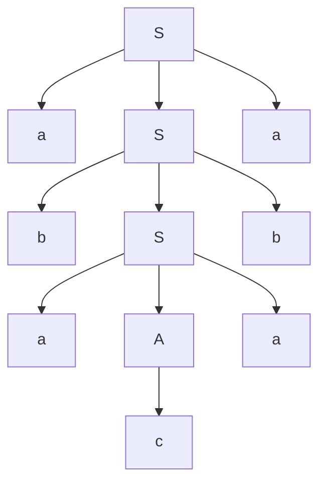
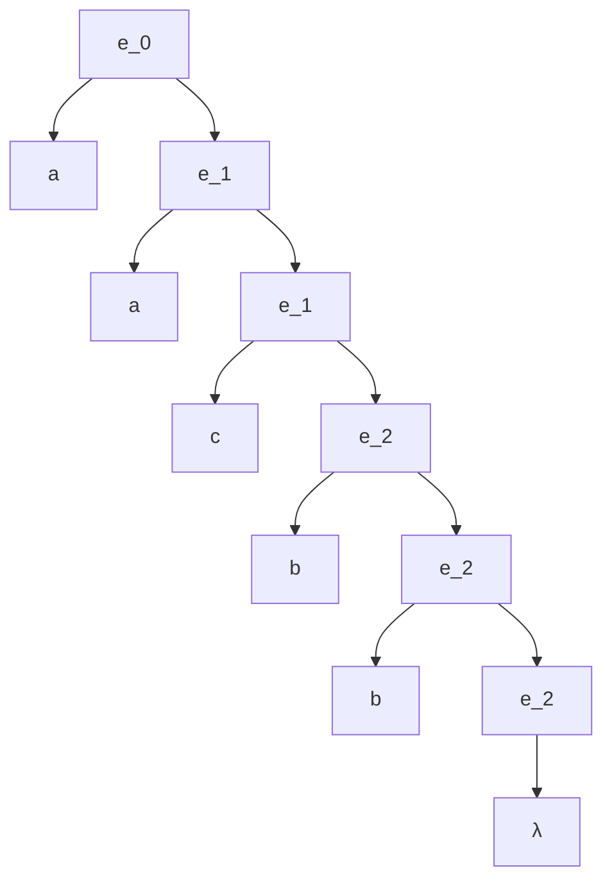

## TRABAJO PRÁCTICO 

# B. GRAMÁTICAS Y LENGUAJES 

13. Defina los conjuntos $P$ de la gramática de $G =  (\lbrace S, A, B, C\rbrace, \lbrace0, 1\rbrace, S, P )$ que reconozca: 

    $0 0 1 0 1 0$​ 

    **Respuesta**:

    $P = \lbrace S \rightarrow A10, A \rightarrow B10, B \rightarrow C0, C \rightarrow 0\rbrace$

    *Explicación*:

    + Se debe crear el conjunto $P$ formado por las producciones que generen la secuencia de caracteres $001010$.
    + Estas producciones o reglas de derivación son aplicadas de la siguiente manera para reconocer la cadena:
      + Partimos del axioma "$S$" aplicando la regla de producción $S \rightarrow A10$ produciendo $A10$.
      + Aplicamos a ese resultado la regla $A \rightarrow B10$ y obtenemos $B1010$.
      + Luego aplicamos $B \rightarrow C0$ produciendo $C01010$.
      + Luego aplicamos $C \rightarrow 0$ reconociendo así la cadena solicitada $001010$.

14. Defina los conjuntos $P$ de la gramática de $G = ( \lbrace S, A, B, C\rbrace, \lbrace0, 1\rbrace, S, P )$ que reconozca: 

    $0 0 0 1 0 1$​ 

    $P = \lbrace S \rightarrow A01, A \rightarrow B1, B \rightarrow C0, C \rightarrow C0 | 0 \rbrace$

    

    $S \rightarrow \underline{A}01 \rightarrow \underline{B}101 \rightarrow \underline{C}0101 \rightarrow \underline{C}00101 \rightarrow 000101$

15. Definir las reglas de una gramática *Tipo 2* en base a la especificación dada, que reconozca el lenguaje: 

    $L1 = \lbrace w^n cw^n / w \in \lbrace a, b\rbrace n > 0\rbrace$

    $G1 = (\lbrace A, S\rbrace, \lbrace a, b, c\rbrace, P, S)$​ 

    a. Al definir una gramática, lo primero es analizar "la forma" de la cadena que se debe generar. En este caso, a izquierda y derecha de $c$ debe aparecer la misma subcadena, con la misma cantidad de símbolos $n>0$.

    b. La cantidad de $w$ está formada por los símbolos $a$ y $b$ según indica en la restricción $w \in \lbrace a,b\rbrace$.

    c. Se definen los símbolos terminales $\lbrace a,b,c\rbrace$ y no-terminales $\lbrace A,S \rbrace$, el conjunto $P$ debe incluir esos dos símbolos no-terminales.

    d. Finalmente sólo queda escribir el conjunto $P$ de reglas de producción.

    Definir las reglas de producción del conjunto $P$ es un proceso similar a diseñar un algoritmo, es decir, que hay que  definir reglas que generen lo que se busca obtener como resultado. 

    En este caso, vamos a definir el axioma de modo tal que garantice que a izquierda y derecha de $c$ genere la misma subcadena.

    $S \rightarrow a\space S \space a\space |\space b\space S\space b$

    Este axioma presenta recursión infinita.

    Por lo tanto es necesario plantear esta segunda versión de $S$, que no sea recursiva.

    $S \rightarrow a\space A \space a\space |\space b\space A\space b$

    $A \rightarrow c$

    Ejemplo de árbol generador

    Cadena generada $a\space b\space a\space c\space a\space b\space a$

16. Defina las reglas de producción para el lenguaje: $L1 = \lbrace a^{n}\space c \space b^{m} / n > 0 y m ≥ 0 \rbrace$ 

17. Para la especificación dada dibuje el árbol de derivación para: $a \space a \space c \space b \space b$ 

    $P = \lbrace e0 \rightarrow  a e1, e1 \rightarrow  a e1 | c e2, e2 \rightarrow b e2 | \lambda \rbrace$

18. *Sea la cuádrupla es $G = (\lbrace S,A,B\rbrace, \lbrace0, 1\rbrace, P, S)$ con el siguiente conjunto de producciones, indique 3 cadenas válidas diferentes y dibuje los respectivos árboles de derivación:* 

    $P : \lbrace S \rightarrow A1B, A \rightarrow 0A | λ, B \rightarrow 0B | 1B | λ \rbrace$

19. Dibuje el árbol de derivación para la cadena $z = (x + y) * z$ correspondiente a la siguiente gramática: 

    $ASSIGN \rightarrow ID \prime=\prime EXPR$ 

    $ID \rightarrow ‘x’ | ‘y’ | ‘z’$ 

    $EXPR \rightarrow ID ‘+’ EXPR | EXPR ‘*’ ID | ‘(‘ EXPR’)’ | ID *$

20. *Verificar si la siguiente gramática, genera cadenas ambiguas, en cuyo caso dar los ejemplos.*

    $G = (\lbrace ‘a’, ‘+’, ‘*’, ‘(‘, ‘)’\rbrace, \lbrace S\rbrace, S, P)$ 

    $P = \lbrace S := ‘a’, S := S ‘+’ S, S := S * S, S := S\rbrace$

21. Construya una gramática regular no ambigua que genere todas las cadenas de $0$ y $1$ en las cuales los $0$, si aparecen, lo hacen en grupos individuales de a tres. 

    Ej. cadenas que pertenecen al lenguaje Ej. cadenas que NO pertenecen al lenguaje $1,11111, 000, 1000, 1110001000$                          $0, 00, 11000011, 000000, 000100$ 

22. *Escriba las reglas de producción para la gramática $G_1$, no ambigua, que reconoce el lenguaje $L_1$*. $G_1 = (\lbrace A\rbrace, \lbrace a, b, c\rbrace, P, S_1)$ $L_1 = \lbrace wcw^{R} / w \in \lbrace a | b\rbrace y R > 0\rbrace$ 

23. Completar las reglas de producción para la gramática. 

    Sea $G = (\lbrace A, B\rbrace, \lbrace a\rbrace, P, S)$ una gramática regular lineal a derecha que genera $L = \lbrace a^{2n} / n ≥ 0\rbrace$

    $S\rightarrow ε$                                                                           $S \rightarrow ?$

    $A\rightarrow aB$                                                                      $A\rightarrow ? $

    $B\rightarrow ?$

24. *Completar las reglas de producción para la gramática.* 

    Sea $G = ({A, B, C}, {0, 1, 2, 3}, P, S)$ *que genera*: $L = {0i 1i+k 2k 3n+1 / i, k, n ≥ 0 }$ 

    $S\rightarrow ABC$                                                                 $S\rightarrow ?$ 

    $S\rightarrow BC$                                                                    $S\rightarrow ?$ 

    $A\rightarrow 0A1$                                                                  $A\rightarrow ?$ 

    $B\rightarrow 1B2$                                                                  $B\rightarrow ?$ 

    $C\rightarrow 3C$                                                                    $C\rightarrow ?$ 

25. Dibuje el diagrama sintáctico equivalente: 

    `<ModDeclaration>::= <MODULE> 'ident' ['priority'] ';' {<Import>} <Block>  'ident''.' `

26. Exprese el equivalente del siguiente diagrama sintáctico, en notación EBNF: **Declaration**

     

27. *Dibuje el diagrama sintáctico equivalente*:

    `<list> ::= <alternative> { ‘|’ <alternative> }[ <else>  ] `

28. *Exprese el equivalente del siguiente diagrama sintáctico, en notación EBNF y BNF:*

    **Named constant** 

    _.png)

29. Re-escriba la expresión en notaciones pre y post fija. Dibuje el árbol de *evaluación*.

    $(x1 + x2) – x3 + (x4 / x5 + x6)$

30. *Re-escriba las expresiones en notaciones pre y post fija. Dibuje el árbol de evaluación.* 

    $a + b * c / d$

     $a * (b + c / 3) * d – k$ 

    $(b / 2 + b * b – 4 * x – 2 * y) / (2 + a)$

    

